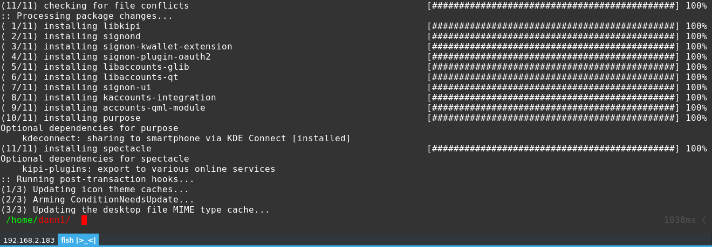

# Description
Yakuake minimalistic skin, no text, no buttons, just tabs. The Open Menu button is the right end of the bottom #3DAEE9 edge. To configure yakuake just edit ***~/.config/yakuakerc***. To exit yakuake:

```bash
 killall yakuake
```

# Screenshot


# Setup
## Manual 
```bash
git clone https://github.com/dann1/yakuake-skin-breeze-tiny.git 
cd yakuake-skin-breeze-tiny
```
For every user

```bash
sudo cp -rpa breeze-tiny /usr/share/skins/yakuake/
```
Just for you

```bash
sudo cp -rpa breeze-tiny ~/.local/share/yakuake/skins/
```

## Plasma
```bash
tar -xc ~/breeze-tiny.tar.gz breeze-tiny/ 
```
Yakuake > Open Menu > Configure Yakuake ... > Appearance > Install Skin > ***~/breeze-tiny.tar.gz*** 

